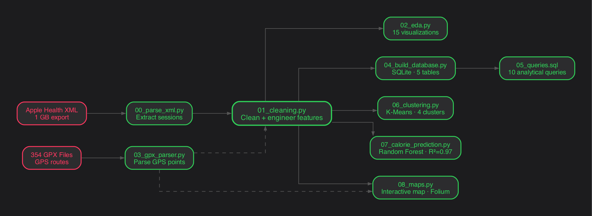

# Running Performance Analysis 🏃

## Motivation

I started running back in high school, but it wasn't until 2020 that it truly became part of my life. In Peru, the mandatory lockdown was long and intense. Running was one of the few reasons you could go outside, and for me, it became a way to disconnect from the stress and anxiety that came with that period. Putting on my headphones and hitting the streets gave me a sense of freedom I couldn't find anywhere else.

What started as a way to cope slowly turned into something more. A habit, a discipline, and eventually a passion. I ran my first half marathon and started training for a full one, until an injury forced me to stop and reset. Today I run for the joy of it, not for competition. It keeps me grounded, and someday I'd like to complete that marathon just to prove I can.

Over the years, without really thinking about it, my Apple Watch recorded every single one of those runs. Pace, heart rate, distance, elevation, weather conditions. Nearly 8 years of data, sitting there. This project is my attempt to make sense of it.

---

## Project Overview

A full data analysis pipeline applied to personal running data exported from Apple Health (2019–2026). The goal is to explore performance trends, identify training patterns, and build predictive models using the same tools and workflow a data analyst would use in a professional setting.

**Stack:** Python · SQLite · SQL · scikit-learn · Power BI · Folium

---

## Dataset

Personal running data exported from Apple Health, recorded via Apple Watch between May 2019 and March 2026. After cleaning, the dataset contains 429 running sessions with 19 features including pace, distance, heart rate, elevation, weather conditions, and pause data. GPS route data was extracted from 354 GPX files, adding over 500,000 GPS points to the analysis.

Raw data is not included in this repository for privacy reasons.

---

## Project Structure

```
running-performance-analysis/
│
├── data/
│   ├── raw/                        # Original Apple Health export (not tracked)
│   └── processed/                  # Cleaned datasets and SQLite database
│
├── scripts/
│   ├── 00_parse_xml.py             # Extract running sessions from Apple Health XML
│   ├── 01_cleaning.py              # Data cleaning and feature engineering
│   ├── 02_eda.py                   # Exploratory data analysis (15 plots)
│   ├── 03_gpx_parser.py            # Extract GPS routes and track points from GPX files
│   ├── 04_build_database.py        # Build relational SQLite database (5 tables)
│   ├── 05_queries.sql              # Analytical SQL queries
│   ├── 06_clustering.py            # K-Means clustering and PCA visualization
│   ├── 07_calorie_prediction.py    # Random Forest calorie prediction models
│   └── 08_maps.py                  # Interactive route map with Folium
│
├── plots/                          # All generated visualizations
├── dashboard/                      # Power BI dashboard (PDF) and interactive map (HTML)
├── .gitignore
└── README.md
```

---

## Pipeline



---

## Analysis Roadmap

- [x] Data extraction from Apple Health XML (444 sessions parsed)
- [x] GPS route extraction from 354 GPX files (525,000+ track points)
- [x] Data cleaning and feature engineering
- [x] Exploratory data analysis — 15 visualizations across 4 thematic blocks
- [x] Relational database — 5 tables, SQLite, joined by run_id
- [x] Analytical SQL queries — 10 queries across volume, performance and routes
- [x] K-Means clustering — 4 session types identified (Short & Intense, Easy, Treadmill, Long Run)
- [x] Calorie prediction — two Random Forest models (R² = 0.97 / 0.95)
- [x] Power BI dashboard — 3 pages, 12 visualizations (see `dashboard/`)
- [x] Interactive GPS map — 258 outdoor routes across Lima, filterable by session type (see `dashboard/running_map.html`)

---

## Dashboard

The Power BI dashboard covers three analytical pages: an overview of 8 years of training volume and pace trends, a performance deep-dive with cluster analysis, and a heart rate and weather conditions breakdown. A static export is available in [`dashboard/Running_Performance_Dashboard.pdf`](dashboard/Running_Performance_Dashboard.pdf).

The interactive GPS map renders all 258 outdoor running routes across Lima, color-coded by session type (Short & Intense, Easy, Long Run). Open it directly in your browser: [Running Map — Lima](https://aeramirezz.github.io/running-performance-analysis/dashboard/running_map.html)

---

## Key Findings

- **Volume:** Training peaked in 2021 during half marathon preparation, nearly disappeared in 2022 due to injury, picked back up in late 2023 with full marathon training (longest runs of the dataset), and has shifted toward shorter sessions since the injury forced another reset in early 2024.
- **Patterns:** Most runs happen on weekdays in the afternoon. Saturday is the day for long runs.
- **Clusters:** K-Means identified 4 distinct session types without any manual labeling — Short & Intense, Easy aerobic, Treadmill, and Long Run.
- **Prediction:** A Random Forest model predicts active calories burned with a mean absolute error of just 10 kcal, using only distance, pace, elevation, and temperature as inputs.